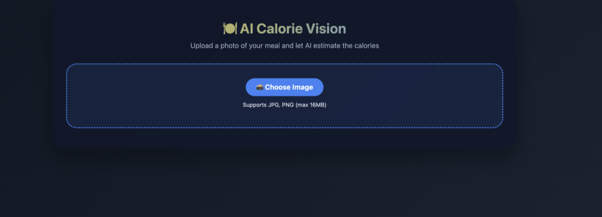
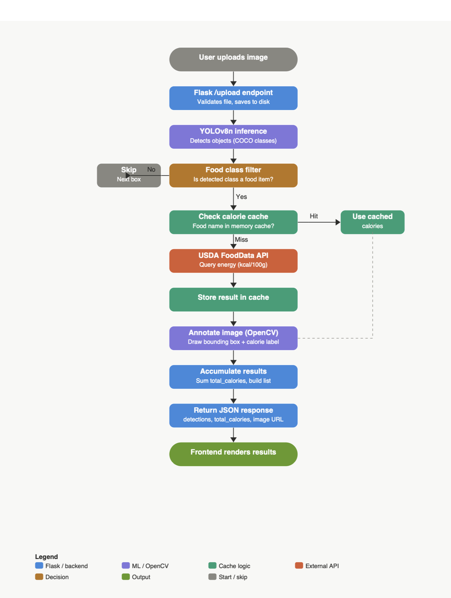

<h2 align="center">🍽️ AI Calorie Vision</h2>

  A web app that detects food items in meal photos using YOLOv8
  and estimates calories via the USDA FoodData Central API.

<h3>🖥️ Interface</h3>

  

<h3>🧠 Overview</h3>

Upload a photo of your meal and AI Calorie Vision will detect food items,
look up their calorie values from the official USDA database, annotate the
image with bounding boxes and calorie labels, and display a total calorie estimate.

<h3>⚙️ How It Works</h3>

  

<ol>
  <li>User uploads a meal image via the web interface</li>
  <li>Flask <code>/upload</code> endpoint receives and saves the image</li>
  <li>YOLOv8n (COCO pretrained) runs object detection</li>
  <li>Non-food classes are filtered out — only food items proceed</li>
  <li>Each food label is queried against the USDA FoodData Central API for Energy (kcal/100g)</li>
  <li>Results are cached in memory to avoid repeated API calls</li>
  <li>OpenCV draws bounding boxes and calorie labels on the image</li>
  <li>Annotated image, per-item calories, and total calories are returned to the frontend</li>
</ol>

<h3>🚀 Features</h3>
<ul>
  <li>🔍 Real-time food detection using <b>YOLOv8n</b> (COCO pretrained)</li>
  <li>🥗 Calorie lookup via <b>USDA FoodData Central API</b> (official USDA nutrient data)</li>
  <li>🖼️ Annotated output image with bounding boxes and calorie labels</li>
  <li>⚡ In-memory calorie cache — no repeated API calls for the same food</li>
  <li>🌐 Clean dark-themed web UI built with HTML/CSS/JavaScript</li>
  <li>🔌 Flask REST backend with <code>/upload</code> endpoint</li>
</ul>

<h3>🍕 Supported Food Classes</h3>

  Detection is filtered to food-related COCO classes:
  apple, banana, orange, broccoli, carrot, hot dog, pizza, donut, cake, sandwich, burger, ice cream, french fries

<h3>🗂️ Repository Structure</h3>
<pre><code>ai-calorie-vision/
├── app.py               ← Flask backend
├── templates/
│   └── index.html       ← Frontend UI
├── uploads/             ← Uploaded and annotated images (auto-created)
├── assets/
│   ├── ui.png
│   └── flowchart.png
└── README.md
</code></pre>

<h3>▶️ How to Run</h3>

<h4>Install dependencies</h4>
<pre><code>pip install flask ultralytics opencv-python requests werkzeug</code></pre>

<h4>Run the app</h4>
<pre><code>python app.py</code></pre>

<h4>Open in browser</h4>
<pre><code>http://localhost:5000</code></pre>

Upload a meal photo and the app will detect food items and estimate calories!

<h3>🛠️ Tech Stack</h3>
<ul>
  <li>Python, Flask — backend</li>
  <li>YOLOv8n (Ultralytics) — food object detection</li>
  <li>USDA FoodData Central API — calorie lookup</li>
  <li>OpenCV — image annotation</li>
  <li>HTML / CSS / JavaScript — frontend</li>
</ul>

